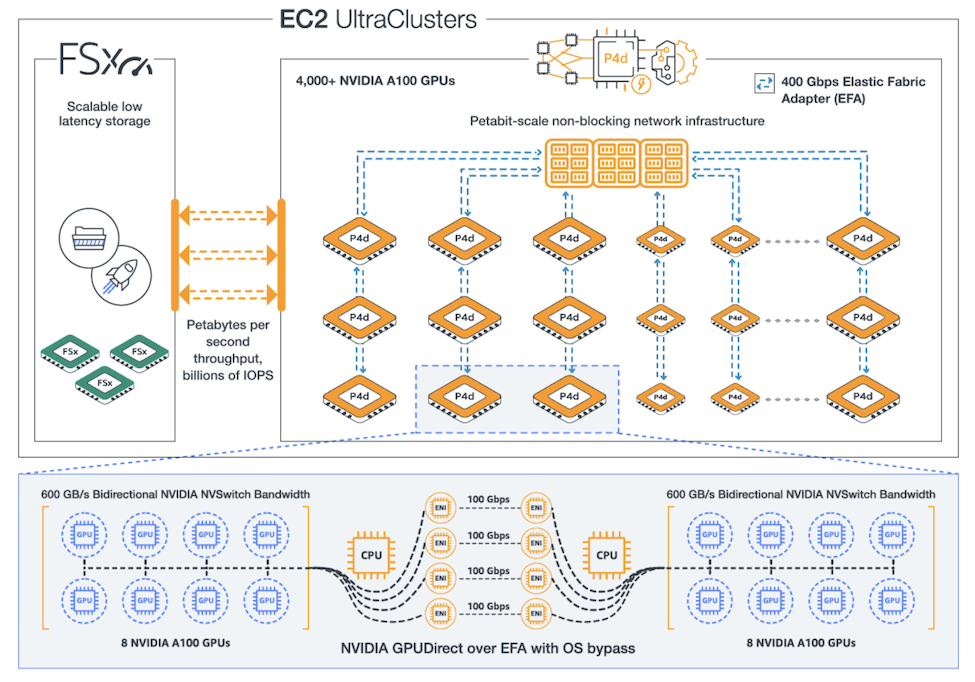

# Megatron on AWS UltraCluster

This is a repository with scripts and configuration files for training a GPT type Natural Language Understanding model using an [AWS P4 Ultracluster](https://pages.awscloud.com/amazon-ec2-p4d.html) and the [NVIDIA Megatron-LM](https://github.com/NVIDIA/Megatron-LM) framework.

[Megatron](https://arxiv.org/pdf/1909.08053.pdf) is a large, powerful transformer developed by the Applied Deep Learning Research team at NVIDIA. Refer to [Megatron's original Github repository](https://github.com/NVIDIA/Megatron-LM) for more information.

## Structure

This repo contains configuration files for [AWS ParallelCluster](https://aws.amazon.com/hpc/parallelcluster/) in the [`configs`](./configs) folder. The configurations implement a tightly coupled cluster of [p4d.24xlarge EC2 instances](https://aws.amazon.com/ec2/instance-types/p4/), leveraging [AWS Elastic Fabric Adapter (EFA)](https://aws.amazon.com/hpc/efa/) and [Amazon FSx for Lustre](https://aws.amazon.com/fsx/lustre/) in a P4D UltraCluster configuration. 

The [`scripts`](./scripts) folder contains scripts to build a custom [Deep Learning AMI](https://docs.aws.amazon.com/dlami/latest/devguide/what-is-dlami.html) with Megatron-LM and its dependencies. It also contains scripts to train a GPT-2 8 billion parameter model, in a 8-way model parallel configuration, using the [SLURM scheduler](https://docs.aws.amazon.com/parallelcluster/latest/ug/schedulers.slurm.html) available through ParallelCluster. 

The [TUTORIAL.md](TUTORIAL.md) describes how-to:
 - Set-up a cluster management environment with AWS ParallelCluster.
 - Build a custom Deep Learning AMI using the `pcluster` [CLI](https://docs.aws.amazon.com/parallelcluster/latest/ug/commands.html).
 - Configure and deploy a multi-queue cluster with CPU and GPU instances.
 - Preprocess the latest English Wikipedia data dump from [Wikimedia](https://www.wikimedia.org/) on a large CPU instance.
 - Train the 8B parameter version of GPT-2 using the preprocessed data across 128 GPUs. 

The Advanced section of the tutorial also describes how to monitor training using [Tensorboard](https://www.tensorflow.org/tensorboard).

## Contribution guidelines

If you want to contribute to models, please review the [contribution guidelines](CONTRIBUTING.md).

## License

[MIT](LICENSE)
